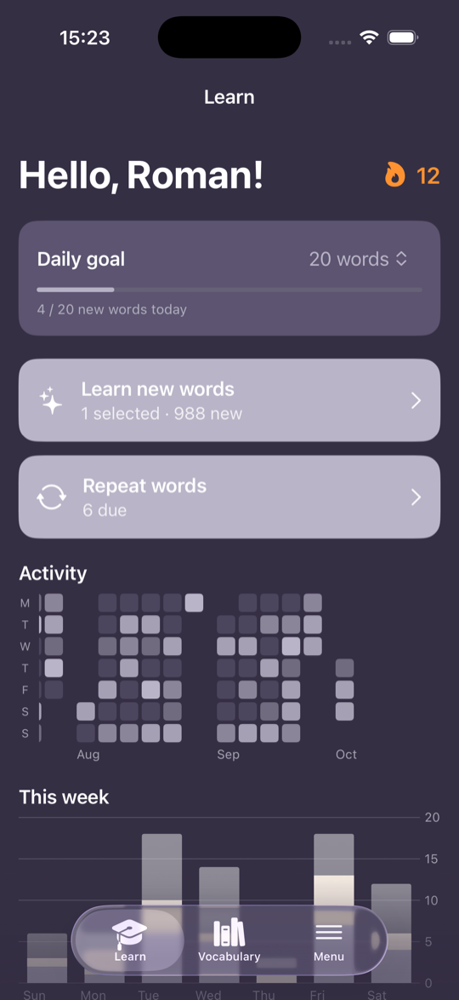
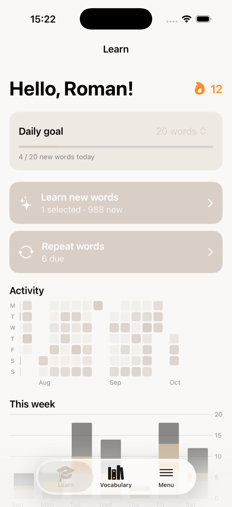
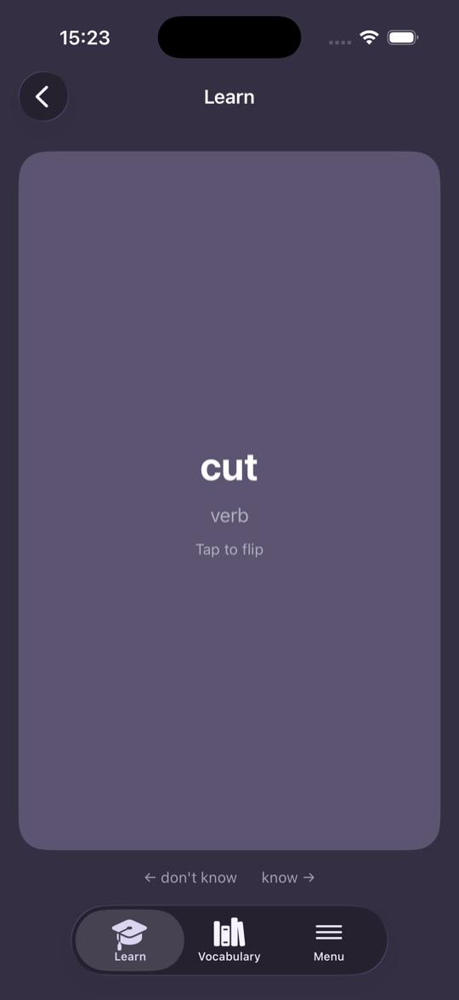
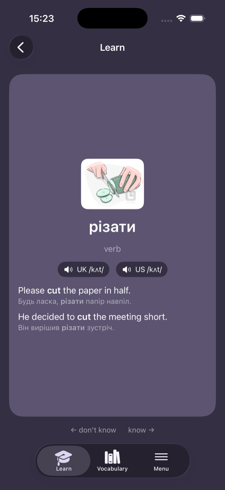
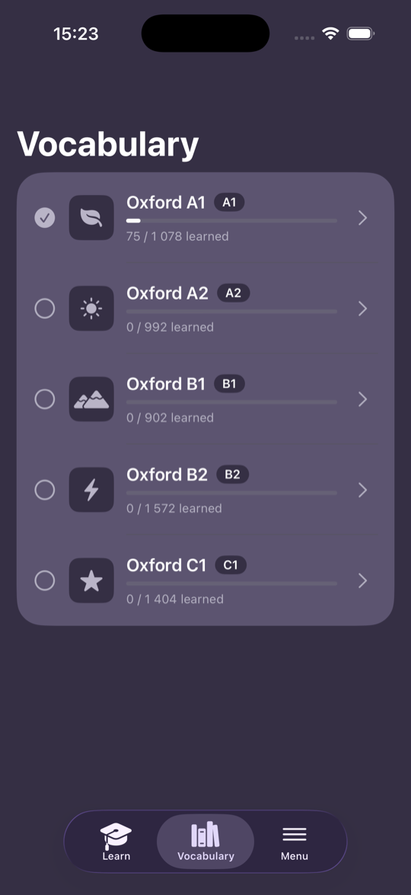
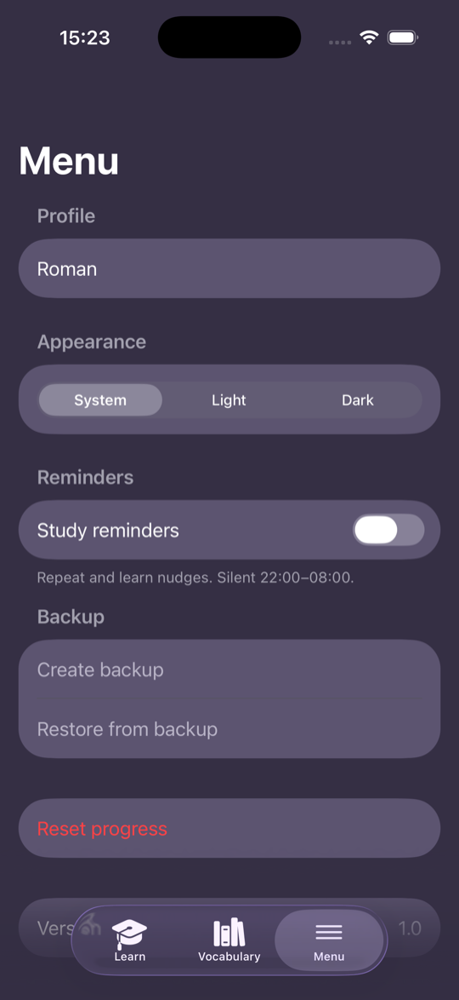

# 📚 English App

A free, offline-first iOS app for learning English vocabulary with swipe cards and spaced repetition on the Ebbinghaus forgetting curve. A personal prototype of a Reword-style trainer, built with SwiftUI and SwiftData, with no third-party dependencies.

<p align="center">
  
  
  
  
</p>
<p align="center">
  
  
</p>

## ✨ Features

- 🃏 **Swipe cards**: swipe right if you know the word, left if you don't. Tap a card to flip it.
- 🧠 **Spaced repetition**: unknown words come back after 1 min, 20 min, 1 day, 3 days, 7 days and 30 days. A miss resets the word to the first step.
- 📖 **5,948 Oxford words**: levels A1–C1, each with Ukrainian translation, part of speech, UK/US transcription and audio, 5 example sentences and an illustration.
- 🎯 **Daily goal**: pick how many new words you want per day; the app stops and congratulates you when you reach it.
- 🔥 **Streak and stats**: day streak, a monthly activity heatmap and a weekly chart of learned, known and repeated words.
- 🔔 **Reminders**: nudges to repeat due words and to learn new ones, three pings per reminder, silent from 22:00 to 08:00.
- 🎨 **Themes**: system, light or dark.
- 💾 **Backup and restore**: export your progress to a JSON file and restore it later.

## 🧭 How to use

1. **Vocabulary tab**: tap a level to select it for learning (you can select several). Tap the chevron to browse its words, search them and sort by A–Z or status.
2. **Learn tab**: hit **Learn new words** to study unknown words from the selected levels, or **Repeat words** to review the ones that are due.
3. Flip the card to see the translation, transcription, examples and picture. Swipe **right** if you knew it, **left** if you didn't.
4. Set your daily goal on the Learn tab and keep the streak going.
5. **Menu tab**: name, theme, reminders, backup and reset.

Words you swipe right on a new card count as known right away. Words you swipe left on enter the repetition ladder.

## 🚀 Getting started

### Requirements

- macOS with Xcode 26 (the command-line tools and iOS simulator come with it)
- [`just`](https://github.com/casey/just): `brew install just`

You can do everything from the terminal or VS Code; the Xcode app is only needed once if you sign in to run on a real device.

### Configure

```sh
cp .env.example .env
```

Fill in `.env` (it is gitignored):

| Variable | Used for |
| --- | --- |
| `BUNDLE_ID` | your own unique reverse-DNS app id, e.g. `com.yourname.englishapp` |
| `SIMULATOR` | simulator name for `just run` (default `iPhone 17 Pro`) |
| `PHONE_UDID`, `PHONE_ID`, `TEAM_ID` | only for installing on a real iPhone, see below |

### Run in the simulator

```sh
just run
```

This builds, boots the simulator, installs the app and launches it. `just build` only builds. The first launch imports the word list, which takes a few seconds.

### Install on your iPhone 📱

1. On the phone: Settings → Privacy & Security → turn on **Developer Mode**, restart, then connect it by USB and tap Trust.
2. On the Mac: sign in to your Apple ID once in Xcode → Settings → Accounts (a free Personal Team is enough).
3. Fill in `.env`:
   - `PHONE_ID`: the identifier from `xcrun devicectl list devices`
   - `PHONE_UDID`: the same phone's UDID as used by `xcodebuild`, from `xcodebuild -showdestinations -project EnglishApp.xcodeproj -scheme EnglishApp`
   - `TEAM_ID`: your team id from Xcode → Settings → Accounts
4. Run:
   ```sh
   just phone
   ```
5. On the phone: Settings → General → VPN & Device Management → trust your developer profile, then open the app.

Apps signed with a free Apple ID expire after 7 days. Run `just phone` again to renew; your data is kept.

## 🗂 Project structure

```
EnglishApp/
├── Domain/      models (Word, Pack, StudyEvent), spaced-repetition rules, study queue, stats, reminder planning
├── Data/        word import, backup, audio playback, notification scheduling
├── Views/       Learn, Vocabulary, Study (swipe card), Menu, Word detail, theme
├── Resources/   packs.json: the bundled word list
└── Assets.xcassets/
```

Run `just --list` to see all commands. The word list is imported on first launch and re-imported only when `contentVersion` in `Seeder.swift` changes; progress is preserved.

## 📝 Notes

- Audio and images are loaded from the internet; everything else works offline.
- The Ukrainian translations come from the source deck and are machine-made, so some are inaccurate.
- The word data comes from an Oxford 3000/5000 Anki deck with Ukrainian translations (audio from Oxford Learner's Dictionaries, images from Langeek). Check the licensing of that content before redistributing it.
- Only Ukrainian translations are available.
